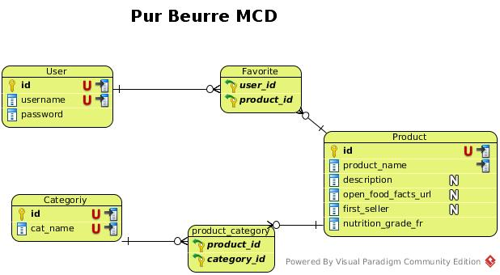

**Auteur:** Tom Gabrièle

**Date de dernière modification:**  29 septembre 2018

**Trello:** [https://trello.com/b/eLZZiDVa/purbeurreweb](https://trello.com/b/eLZZiDVa/purbeurreweb) 

**Github:** [https://github.com/tomlemeuch/pur_beurre_web](https://github.com/tomlemeuch/pur_beurre_web)

**Travis:** [https://travis-ci.org/tomlemeuch/pur_beurre_web](https://travis-ci.org/tomlemeuch/pur_beurre_web)

**Url du projet:** [https://purbeurretg.herokuapp.com](https://purbeurretg.herokuapp.com)

# Retour sur le projet n°8 : Créez une plateforme pour amateurs de Nutella
## Démarche

### Mise en place des outils et choix des tecknologies

#### Backend
Pour le backend, le language utilisé est python dans sa version 3.7 avec le framework django.

#### Frontend
Le frontend est basé tout naturellement sur du html5/css3 accompagné du framework bootstrap 4 et d'un thème demandé par le client et de javascript et sa librairie jquery.

#### UML
Pour créer le diagramme de classe et le MCD, l'outil Visual Paradigm a été utilisé.

#### Tableau Agile
Trello a été utilisé pour le suivi de la réalisation des user stories.

#### Versionning
L'outil de versionning utilisé est git et le dépôt a été créé sur Github.

Le projet comprend 2 branches principale: **master** et **development**. 

Pour chaque nouvelle fonctionnalité, une nouvelle branche a été créé à partir de la branche **development**. Une fois la fonctionnalité écrite, sa branche correspondante est fusionnée (merge) dans **development**. 

La fusion dans la branche **master** n'a été faite qu'à partir de la première version fonctionnelle de l'application.

### Test Driven Development
Les principes du TDD ont été respecté dans 90% des cas.
Ce qui veut dire que le cycle de développement de chaque fonctionnalité a été le suivant:
1. Création d'une nouvelle branche à partir de la branche **development**.
2. Écriture d'un test.
3. Lancement et échec du test.
4. Écriture du code pour faire fonctionner le test.
5. Amélioration du test.
6. Retour à l'étape 3 tant que c'est nécessaire.
7. Lancement de tous les tests du projet.
8. Correction si nécessaire.
9. Commit de la fonctionnalité.
10. Fusion avec la branche **development**

Utilisation de Travis à chaque push. 

### Découpage du projet
Le projet a été mené dans l'ordre suivant:
#### Page d'accueil et customisation du thème
La réalisation de la page d'accueil a été l'occasion de "surcharger" le thème bootstrap demandé par le client. Pour cela la syntaxe sass a été utilisée. Pour convertir à la volée le fichier scss en fichier css , la librairie python django-sass-processor a été utilisée.
#### Page de login et page de création de compte
Le modèle AbstractUser de django est hérité par le modèle CustomUser pour définir l'email comme identifiant de l'utilisateur. 
#### Script de récupération des données depuis l'API OpenFoodFacts et travail sur la FromApiUpdateMixin
Il s'agit d'une des plus grosses parties du projet. La commande django  script api_to_db fait appel aux méthodes de classe des modèles Product et Category qui héritent de FromApiUpdateMixin. Ces méthodes s'appuient sur des attributs de classe et permettent de :
- définir les urls de récupération d'un élément ou d'une liste d'éléments,
- requêter l'API d'OpenFoodFacts pour récupérer un élément ou d'une liste d'éléments,
- écrire les données récupérées dans un fichier,
- insérer les données en base de données.

Tous ceci est évidement le plus générique possible pour pouvoir être utilisé sur différents modèles.

Les informations qui varient d'un modèle à l'autre sont stockées dans des attributs de classe. Dans la majeure partie des cas les noms des champs du modèle correspondent aux clés présentes dans les données récupérées sur l'API d'OpenFoodFacts. Mais il est tout de même possible de définir des correspondances via un attribut. 

Un autre attribut permet de définir les données strictement requises.

La commande api_to_db propose les options suivantes:
- start_page: page de démarage de récupération des produits.
- nb_pages: nombre de pages de produits à récupérer.
- from_cache: récupère les données depuis un cache constitué lors de la dernière récupération.
- grumpy_mode: mode strict qui permet d'ignorer les produits qui ne contiennent pas toutes les données strictement requises.
- categories_tags: permet de filtre les produits en fonction des identifiants de une ou plusieurs catégories.
- hard_reset: permet d'effacer tous les produits (non enregistrés dans les favoris utilisateur) et leurs catégories de la base de donnée avant de faire la récupération des données depuis l'API d'OpenFoodFacts.

#### Pages de recherche et Algorithme de recherche
La recherche s'appuie sur un helper search_product qui permet de créer par ordre de priorité (d'abord la combinaison de mots exact puis dans le désordre ou partielle) toutes les combinaisons de mots possibles à partir de la recherche saisie. Les résultats sont renvoyés par ordre de pertinence.
Ces mêmes résultats sont stockés dans une variable de session afin d'être réutilisé sur la fiche du produit qui sera visitée.

#### Page produit

Cette page présente évidemment la fiche du produit avec toutes ses caractéristiques nutritionnelles. Mais elle liste également les produits de substitutions ordonnés par note nutritionnelle.
La liste est présentée en 2 parties:
Tous d'abord les produits qui correspondent à la recherche précédente (donc qui ont des termes en commun avec le produit visualisé) puis ceux qui appartiennent aux mêmes catégories. 

#### Ajout aux favoris et page des favoris

L'ajout aux favoris est uniquement accessible aux utilisateurs authentifiés. Cette ajout se fait par le biais d'une requête AJAX.

## Difficultés et solutions
### Organisation des templates

La mauvaise répartition des templates entre le dossier de l'application substitute_finder et celui du projet pur_beurre_web a été causée par un mauvais découpage du template de base. Exemple: 
Le snippet de base navbar contient un formulaire de l'application substitute_finder. Il ne s'agit donc pas d'un template de base mais bien d'un template propre à l'application substitute_finder.

### Envoi de mail avec Sendgrid

Pour envoyer les mails de réinitialisation de mot de passe, sendgrid est utilisé (un addon est également proposé par heroku). Lors des tests en situation réelle, il est apparu que certains webmail  (free, hotmail, gmail...) bloquent les mails en provenance de sendgrid. Finalement la situation est rentrée dans l'ordre avec le temps (en laissant passer une période entre 2 envoie de mails vers une même adresse). Les derniers tests montrent que les mails parviennent bien à l'utilisateur concerné. 

### Une base de données trop grosse pour Heroku
Pour déployer le projet le plan gratuit d' Heroku suffit.

Le déploiement du projet nécessite également l' addon PostgreSQL.

Par contre pour mettre en place la base de données la version gratuite de l'addon n'autorise que 10000 lignes. Heroku donne 7 jours à l'utilisateur pour régulariser si ce plafond est dépassé. Au delà, les accès en écriture sur la base sont révoqués. Il devient donc impossible de se connecter sur le site du projet puisque django ne peut plus écrire dans la table session. Il est également impossible de rajouter un article aux favoris pour les mêmes raisons.

Pour solutionner le problème plusieurs pistes:

- Tout d'abord, seuls les produits fabriqués en France sont récuprérées.
- Ajout des fonctionnalités au script de récupération pour limiter la récupération aux produits et catégories qui présentent des données nutritionnelles complètes.
- Ajout d'une option de filtre par catégorie sur ma commande de récupération.

Le risque de cette dernière fonctionnalité est de faire perdre tout son intérêt à l'application à cause d'un nombre d'articles trop limités dans la base de données.

Pour info: [https://devcenter.heroku.com/articles/heroku-postgres-plans#hobby-tier](https://devcenter.heroku.com/articles/heroku-postgres-plans#hobby-tier) 

##Pistes d'amélioration
- Certaines fonctions demandent une bonne cure d'amaigrissement. Un peu de refactoring ne serait pas de trop!
- Prévoir une autocomplétion sur les champs de formulaire.
- Mettre à jour les produits à partir de l'API OpenFoodFacts à chaque requête de type get ou filter.